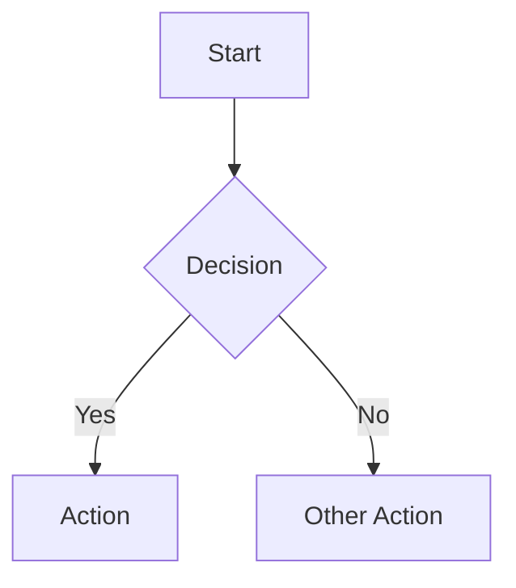
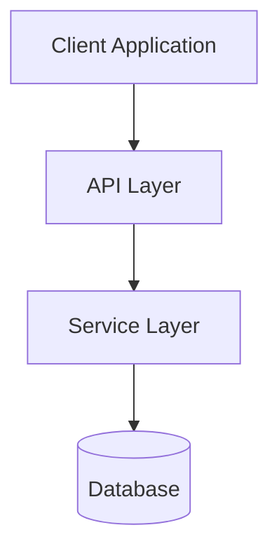
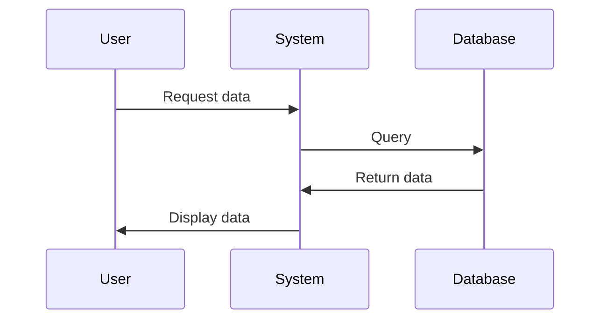
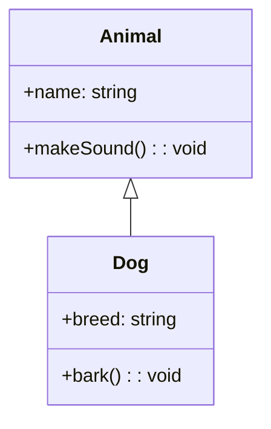
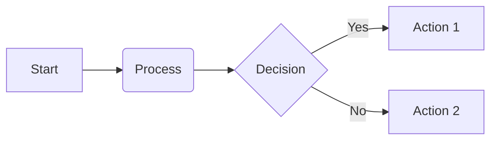

# Diagram Standards

All diagrams in documentation must be created using Mermaid markdown notation. This ensures consistency, versioning capability, and native rendering in GitHub and other markdown viewers.

## Usage Guidelines

1. Use Mermaid for all types of diagrams:
   - Architecture diagrams
   - Sequence diagrams
   - Flow charts
   - Class diagrams
   - Entity-relationship diagrams
   - State diagrams
   - Gantt charts

2. Embed Mermaid diagrams directly in markdown files using the following syntax:

```markdown

```

3. Keep diagrams simple and focused on communicating core concepts
4. Use consistent naming and styling across all diagrams
5. Include a text description alongside each diagram for accessibility
6. For complex diagrams, break them into smaller, more focused diagrams

## Common Diagram Types

### Architecture Diagram



### Sequence Diagram



### Class Diagram



### Flow Chart



## Best Practices

1. **Version Control**: Mermaid diagrams in markdown are version-controlled with the code
2. **Consistency**: Use consistent styling, colors, and notation
3. **Accessibility**: Always include text descriptions for diagrams
4. **Simplicity**: Keep diagrams focused on communicating key points
5. **Maintenance**: Update diagrams when the architecture changes

## Tools

- **Mermaid Live Editor**: https://mermaid.live/ for prototyping diagrams
- **VS Code Extensions**: Mermaid Preview for local editing
- **GitHub**: Natively renders Mermaid in markdown files

## Resources

- [Mermaid Official Documentation](https://mermaid-js.github.io/mermaid/#/)
- [Mermaid Cheat Sheet](https://jojozhuang.github.io/tutorial/mermaid-cheat-sheet/)