# Documentation Review Process

This guide explains the review and verification process for documentation generated with the Documentation Generator.

## Why Review Documentation?

Documentation review ensures that:
- Documentation meets requirements and standards
- Information is accurate and complete
- Documentation is clear and usable
- Technical details are correct
- Style is consistent

## The Documentation Review Cycle

The Documentation Generator supports a comprehensive review process:

```mermaid
graph LR
    Requirements[Define Requirements] --> Generate[Generate Documentation]
    Generate --> SelfReview[Self-Review]
    SelfReview --> PeerReview[Peer Review]
    PeerReview --> TechnicalReview[Technical Review]
    TechnicalReview --> UserReview[User Review]
    UserReview --> Update[Update Documentation]
    Update --> Validate[Validate Against Requirements]
    Validate --> Approve[Approve Documentation]
```



## 1. Self-Review

After generating documentation, perform a self-review:

```bash
# Run automated self-review
docgen review --self

# Lint documentation
docgen lint

# Validate against requirements
docgen validate --requirements api-docs
```

The self-review verifies:
- Requirements coverage
- Structure and organization
- Formatting and style
- Cross-references and links
- Technical accuracy (basic checks)

### Self-Review Template

The Documentation Generator provides a self-review template:

```bash
# Generate self-review template
docgen review template --self --output review-checklist.md
```

This creates a checklist like:

```markdown
## Self-Review Checklist

### Structure
- [ ] Documentation follows the required structure
- [ ] All required sections are present
- [ ] Information flow is logical

### Content
- [ ] All requirements are addressed
- [ ] Technical information is accurate
- [ ] Examples are working and relevant
- [ ] No placeholder content remains

### Style
- [ ] Consistent formatting throughout
- [ ] Language follows style guidelines
- [ ] No spelling or grammatical errors
- [ ] Diagrams follow standards

### Technical
- [ ] Code examples run successfully
- [ ] API descriptions match implementation
- [ ] Parameter descriptions are complete
- [ ] Return values are documented
```

## 2. Peer Review

Request peer review from team members:

```bash
# Create a review request
docgen review request --type peer --reviewer "Jane Smith"

# Create a pull request for review
docgen review pull-request --title "API Documentation Review"
```

This creates a review task and optionally a pull request.

### Peer Review Process

The peer review focuses on:
- Readability and clarity
- Completeness of information
- Structure and organization
- Adherence to standards
- Style consistency

### Peer Review Template

Generate a peer review template:

```bash
# Generate peer review template
docgen review template --peer --output peer-review.md
```

This creates a structured review form:

```markdown
## Peer Review Feedback

### Overall Assessment
- [ ] Accepted
- [ ] Accepted with minor changes
- [ ] Needs significant revision
- [ ] Rejected

### Specific Feedback

#### Structure and Organization
[Provide feedback on document structure]

#### Content Completeness
[Provide feedback on completeness]

#### Clarity and Readability
[Provide feedback on clarity]

#### Style and Formatting
[Provide feedback on style]

#### Suggestions for Improvement
[Provide specific suggestions]
```

## 3. Technical Review

Request technical review by subject matter experts:

```bash
# Create a technical review request
docgen review request --type technical --reviewer "John Doe"
```

### Technical Review Process

The technical review focuses on:
- Technical accuracy of content
- Correctness of code examples
- Completeness of technical details
- Accuracy of diagrams and models
- Technical feasibility of instructions

### Technical Review Template

Generate a technical review template:

```bash
# Generate technical review template
docgen review template --technical --output tech-review.md
```

This creates a technically-focused review form:

```markdown
## Technical Review Feedback

### Technical Accuracy Assessment
- [ ] Completely accurate
- [ ] Minor technical issues
- [ ] Significant technical issues
- [ ] Major technical inaccuracies

### Specific Technical Feedback

#### Architectural Accuracy
[Provide feedback on architectural descriptions]

#### API Documentation Accuracy
[Provide feedback on API documentation]

#### Code Example Correctness
[Provide feedback on code examples]

#### Technical Omissions
[Note any missing technical details]

#### Suggested Technical Corrections
[Provide specific technical corrections]
```

## 4. User Review

When possible, request review from the target audience:

```bash
# Create a user review request
docgen review request --type user --reviewer "user@example.com"
```

### User Review Process

The user review focuses on:
- Usability of the documentation
- Clarity for the target audience
- Completeness from a user perspective
- Effectiveness of examples
- Navigation and findability

### User Review Template

Generate a user review template:

```bash
# Generate user review template
docgen review template --user --output user-review.md
```

This creates a user-focused review form:

```markdown
## User Review Feedback

### Usability Assessment
- [ ] Very usable - I could accomplish my tasks easily
- [ ] Mostly usable - I could accomplish tasks with some effort
- [ ] Difficult to use - I struggled to accomplish tasks
- [ ] Unusable - I could not accomplish my tasks

### Specific User Feedback

#### Clarity
[Was the documentation clear and understandable?]

#### Completeness
[Did the documentation answer all your questions?]

#### Examples
[Were the examples helpful and relevant?]

#### Navigation
[Could you find information easily?]

#### Missing Information
[What information was missing that you needed?]
```

## 5. Update Documentation

Based on review feedback, update the documentation:

```bash
# Update documentation based on reviews
docgen update --from-reviews

# Generate specific updates
docgen generate --specific "authentication section"
```

Ensure all review comments are addressed through:
- Direct changes to the documentation
- Clarifications where needed
- Additional examples or details
- Restructuring for better clarity

## 6. Validate Against Requirements

After updates, revalidate against the original requirements:

```bash
# Validate updated documentation
docgen validate --requirements api-docs
```

This ensures the documentation still meets all requirements after changes.

## 7. Approve Documentation

Once all reviews are complete and requirements are met, approve the documentation:

```bash
# Approve documentation
docgen review approve --requirements api-docs
```

This marks the documentation as approved and ready for publication.

## Automated Review Checks

The Documentation Generator includes automated review capabilities:

```bash
# Run all automated checks
docgen review check --all

# Run specific checks
docgen review check --spelling --links --code-examples
```

Available automated checks include:
- Spelling and grammar
- Link validation
- Code example validation
- Image and diagram checks
- Style guide compliance
- Reading level analysis
- Structure validation
- Cross-reference validation

## Continuous Integration

Integrate documentation review into your CI pipeline:

```yaml
# GitHub Actions Example
name: Documentation Review
on:
  pull_request:
    paths:
      - 'docs/**'
jobs:
  review-docs:
    runs-on: ubuntu-latest
    steps:
      - uses: actions/checkout@v3
      - name: Install Documentation Generator
        run: pip install docgen
      - name: Run automated review
        run: docgen review check --all
      - name: Validate requirements
        run: docgen validate --requirements-all
```

## Review Metrics

Track documentation review metrics:

```bash
# Generate review metrics report
docgen review metrics --report metrics.json
```

This provides metrics such as:
- Time spent in review
- Number of issues found
- Categories of issues
- Resolution rate
- Requirements coverage

## Review Templates

Customize review templates in `.docgen/templates/reviews/`:

```
.docgen/
  templates/
    reviews/
      self_review.md
      peer_review.md
      technical_review.md
      user_review.md
```

## Configuration

Configure the review process in `.docgen/config.yml`:

```yaml
review:
  required_reviews:
    - self
    - peer
    - technical
  optional_reviews:
    - user
  approvals_required: 2
  blocking_severity: high
  automated_checks:
    enabled: true
    blocking: false
```

## Best Practices

### 1. Schedule Regular Reviews

Don't wait for major changes to review documentation:

```bash
# Schedule regular review
docgen review schedule --interval weekly
```

### 2. Use Multi-Stage Reviews

Different review types find different issues:

```bash
# Create multi-stage review
docgen review create --stages "self,peer,technical,user"
```

### 3. Provide Clear Review Criteria

Give reviewers specific things to check:

```bash
# Create review with specific criteria
docgen review request --criteria "technical-accuracy,completeness,usability"
```

### 4. Capture Metrics

Track review effectiveness over time:

```bash
# Generate review metrics report
docgen review metrics --timeframe "last 3 months"
```

### 5. Link Reviews to Requirements

Make sure reviews verify requirements are met:

```bash
# Link review to requirements
docgen review link --requirements api-docs
```

## Conclusion

A thorough review process ensures documentation quality and effectiveness. By following this process, you can be confident that your documentation meets the needs of its audience and accurately reflects your system.

## Next Steps

- Learn about [Compliance Documentation](compliance_documentation.md) for regulated environments
- Explore the [User Guide](../user_guide/README.md) for more information on using the Documentation Generator